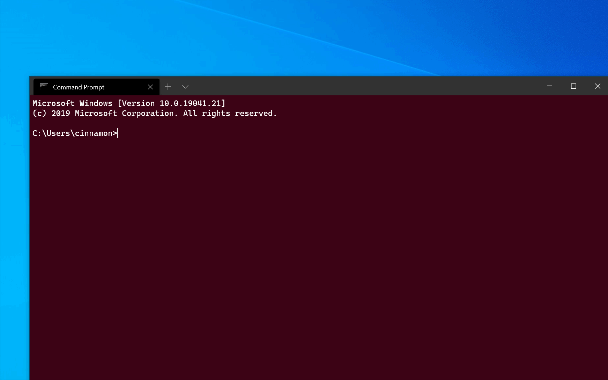

# Create command line arguments for Windows Terminal

## Launching Windows Terminal from the command line

You can use `wt.exe` to open a new instance of Windows Terminal. You can also use the execution alias `wt` instead. If you have a development build of Windows Terminal available, you can open that using `wtd.exe` or `wtd`. This will always open a new window. Windows Terminal is not yet capable of opening new tabs or panes to an existing instance.



## `wt` syntax

The `wt` command line is divided into two main sections: "Options" and "Commands":

```bash
wt [options] [command ; ]
```

Options are a list of flags and other parameters that can control the behavior of the `wt` command line as a whole. Commands are a semicolon-delimited list of commands and arguments for those commands.

If no command is specified, then the command is assumed to be `new-tab` by default. This allows for the following interpretations:

| Command | Interpretation |
|--|--|
| `wt cmd.exe` | `wt new-tab cmd.exe` |
| `wt ; ; ;` | `wt new-tab ; new-tab ; new-tab ; new-tab` |

### Options

| Option | Description |
|--|--|
| `--help`, `-h`, `-?`, `/?` | Displays the help message. |

### Commands

| Command | Description |
|--|--|
| `new-tab` | Opens a new tab with the given customizations. On its first invocation, this also opens a new window. |
| `split-pane` | Creates a new pane in the currently focused tab by splitting the given pane vertically or horizontally. |
| `focus-tab` | Moves focus to a given tab. |

#### `new-tab`

```bash
new-tab [terminal_parameters]
```

This opens a new tab with the given customizations. On its first invocation, this also opens a new window. Subsequent `new-tab` commands will all open new tabs in the same window.

##### Parameters

- `[terminal_parameters]` Reference Terminal Parameters

#### `split-pane`

```bash
split-pane [-h]|[-v] [terminal_parameters]
```

This opens a new pane with the given customizations in the currently focused tab by splitting the given pane vertically or horizontally.

##### Parameters

- `-h`, `-v`: Used to indicate which direction to split the pane. `-v` is "vertically" (think `[|])`, and `-h` is "horizontally" (thing `[-]`). If omitted, defaults to "auto", which splits the current pane in whatever the larger dimension is. If both `-h` and `-v` are provided, defaults to vertical.
- `[terminal_parameters]` Reference Terminal Parameters

#### `focus-tab`

```bash
focus-tab [--target, -t tab-index]
```

Moves focus to a given tab.

##### Parameters

- `--target, -t tab-index`: moves focus to the tab at index `tab-index`. If omitted, defaults to 0 (the first tab).

#### `[terminal_parameters]

Some of the preceding commands are used to create a new terminal instance. These commands are listed above as accepting `[terminal_parameters]` as a parameter. For these commands, `[terminal_parameters]` can be any of the following:

`[--profile,-p profile-name] [--startingDirectory,-d starting-directory] [commandline]`

- `--profile,-p profile-name`: Use the given profile to open the new tab/pane,
  where `profile-name` is the `name` or `guid` of a profile. If `profile-name`
  does not match _any_ profiles, uses the default.
- `--startingDirectory,-d starting-directory`: Overrides the value of
  `startingDirectory` of the specified profile, to start in `starting-directory`
  instead.
- `commandline`: A command line to replace the default command line of the
  selected profile. If the user wants to use a `;` in this command line, it
  should be escaped as `\;`.

### Executing multiple commands

A semicolon `;` is used to delimit a sequence of `wt` commands. This allows you to create more complex instances of Terminal with multiple tabs and panes.

Some shells may already use a semicolon `;` as a reserved character. Powershell, for example, uses them to delimit statements. You can use backticks  `` ` `` to escape semicolon characters, or add the `--%` option to interpret the sequence literally.

| Powershell Command | Description |
|--|--|
| `wt foo1 ; bar1 ; foo2 ; bar2` | Open a tab running the command `foo1 ; bar1 ; foo2 ; bar2` |
| ``wt foo1 ; bar1 `; foo2 ; bar2`` | Open a total of 2 tabs. Each running the following command...<ul> <li>`foo1 ; bar1` </li> <li>`foo2 ; bar2`</li> </ul> |
| `wt --% foo1 ; bar1 ; foo2 ; bar2` | Open a total of 4 tabs. Each running the following command...<ul> <li>`foo1`</li> <li>`bar1`</li> <li>`foo2`</li> <li>`bar2`</li> </ul> |

## Examples

| Command | Description |
|--|--|
| `wt -d .` | Opens the Terminal with the default profile in the current working directory. |
| `wt -d . ; new-tab -d C:\ pwsh.exe` | Opens the Terminal with two tabs. The first is running the default profile starting in the current working directory. The second is using the default profile with pwsh.exe as the "commandline" (instead of the default profile's "commandline") starting in the C:\ directory. |
| `wt -p "Windows PowerShell" -d . ; split-pane -V wsl.exe` | Opens the Terminal with two panes, split vertically. The top pane is running the profile with the name "Windows Terminal" and the bottom pane is running the default profile using wsl.exe as the "commandline" (instead of the default profile's "commandline"). |
