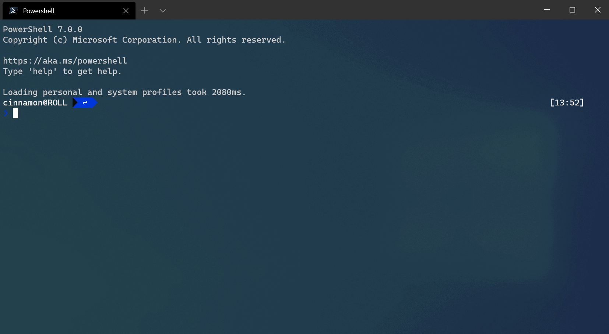
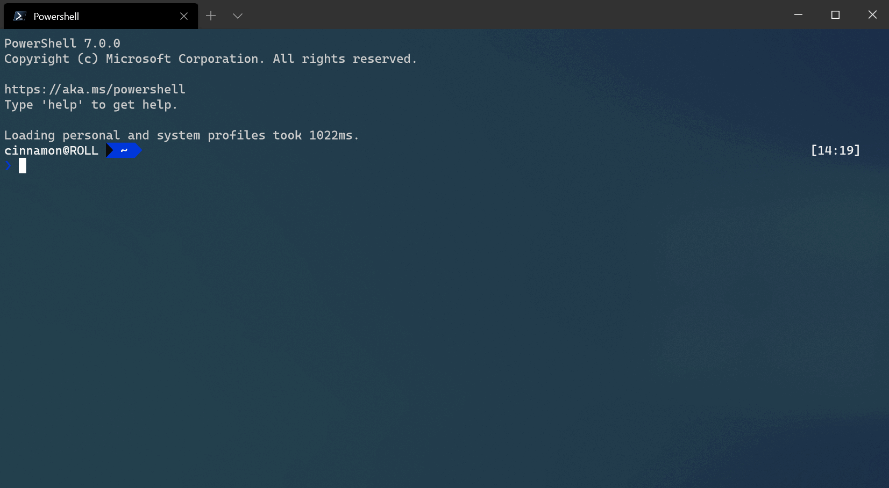
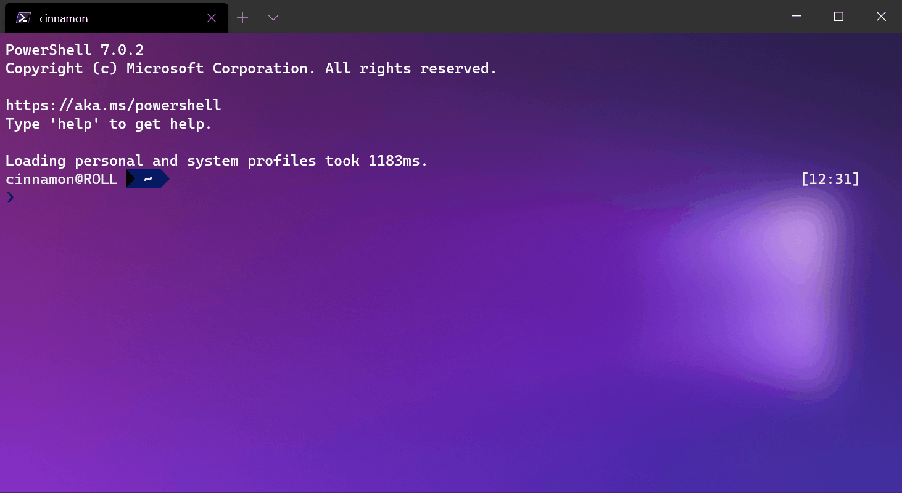

# Global settings in Windows Terminal

The properties listed below affect the entire terminal window, regardless of the profile settings. These should be placed at the root of your settings.json file.

## Default profile

Set the default profile that opens by typing <kbd>ctrl+shift+t</kbd>, typing the key binding assigned to `newTab`, running `wt new-tab` without specifying a profile, or clicking the '+' icon.

**Property name:** `defaultProfile`

**Necessity:** Required

**Accepts:** GUID or profile name as a string

**Default value:** PowerShell's GUID

> [!IMPORTANT]
> Using the profile name for `defaultProfile` is only available in [Windows Terminal Preview](https://aka.ms/terminal-preview/).

 

___

## Disable dynamic profiles

This sets which dynamic profile generators are disabled, preventing them from adding their profiles to the list of profiles on startup. For information on dynamic profiles, visit the [Dynamic profiles page](./../dynamic-profiles.md).

**Property name:** `disabledProfileSources`

**Necessity:** Optional

**Accepts:** `"Windows.Terminal.Wsl"`, `"Windows.Terminal.Azure"`, and/or `"Windows.Terminal.PowershellCore"` inside an array

**Default value:** `[]`

 

___

## Dark/Light theme

:::row:::
:::column span="":::
This sets the theme of the application. `"system"` will use the same theme as Windows.

**Property name:** `theme`

**Necessity:** Optional

**Accepts:** `"system"`, `"dark"`, `"light"`

**Default value:** `"system"`

:::column-end:::
:::column span="":::

_Configuration: [Powerline in PowerShell](./../custom-terminal-gallery/powerline-in-powershell.md)_

:::column-end:::
:::row-end:::

 

___

## Tab settings

### Always show tabs

:::row:::
:::column span="":::
When this is set to `true`, tabs are always displayed. When it's set to `false` and `showTabsInTitlebar` is set to `true`, tabs are always displayed underneath the title bar. When this is set to `false` and `showTabsInTitlebar` is set to `false`, tabs only appear after more than one tab exists by typing <kbd>ctrl+shift+t</kbd> or by typing the key binding assigned to `newTab`. Note that changing this setting will require starting a new terminal instance.

**Property name:** `alwaysShowTabs`

**Necessity:** Optional

**Accepts:** `true`, `false`

**Default value:** `true`

:::column-end:::
:::column span="":::

:::column-end:::
:::row-end:::

### Tab width mode

:::row:::
:::column span="":::
This sets the width of the tabs. `"equal"` makes each tab the same width. `"titleLength"` sizes each tab to the length of its title. `"compact"` will shrink every inactive tab to the width of the icon, leaving the active tab more space to display its full title.

**Property name:** `tabWidthMode`

**Necessity:** Optional

**Accepts:** `"equal"`, `"titleLength"`, `"compact"`

**Default value:** `"equal"`

:::column-end:::
:::column span="":::

:::column-end:::
:::row-end:::

> [!IMPORTANT]
> The `"compact"` setting is only available in [Windows Terminal Preview](https://aka.ms/terminal-preview/).

### Hide close all tabs popup

:::row:::
:::column span="":::
When this is set to `true`, closing a window with multiple tabs open _will_ require confirmation. When it's set to `false`, closing a window with multiple tabs open _will not_ require confirmation.

**Property name:** `confirmCloseAllTabs`

**Necessity:** Optional

**Accepts:** `true`, `false`

**Default value:** `true`

:::column-end:::
:::column span="":::

:::column-end:::
:::row-end:::

 

___

## Launch settings

### Launch on startup ([Preview](https://aka.ms/terminal-preview/))

When set to `true`, this enables the launch of Windows Terminal at startup. Setting this to `false` will disable the startup task entry. Note: if the Windows Terminal startup task entry is disabled either by org policy or by user action this setting will have no effect.

**Property name:** `startOnUserLogin`

**Necessity:** Optional

**Accepts:** `true`, `false`

**Default value:** `false`

> [!IMPORTANT]
> This feature is only available in [Windows Terminal Preview](https://aka.ms/terminal-preview/).

### Launch size

This defines whether the terminal will launch as maximized, fullscreen, or in a window.

**Property name:** `launchMode`

**Necessity:** Optional

**Accepts:** `"default"`, `"maximized"`, `"fullscreen"`

**Default value:** `"default"`

> [!IMPORTANT]
> The `"fullscreen"` setting is only available in [Windows Terminal Preview](https://aka.ms/terminal-preview/).

### Launch position

This sets the pixel position of the top left corner of the window upon first load. On a system with multiple displays, these coordinates are relative to the top left of the primary display. If an X or Y coordinate is not provided, the terminal will use the system default for that value. If `launchMode` is set to `"maximized"`, the window will be maximized on the monitor specified by those coordinates.

**Property name:** `initialPosition`

**Necessity:** Optional

**Accepts:** Coordinates as a string in the following formats: `","`, `"#,#"`, `"#,"`, `",#"`

**Default value:** `","`

### Columns on first launch

This is the number of character columns displayed in the window upon first load. If `launchMode` is set to `"maximized"`, this property is ignored.

**Property name:** `initialCols`

**Necessity:** Optional

**Accepts:** Integer

**Default value:** `120`

### Rows on first launch

This is the number of rows displayed in the window upon first load. If `launchMode` is set to `"maximized"`, this property is ignored.

**Property name:** `initialRows`

**Necessity:** Optional

**Accepts:** Integer

**Default value:** `30`

### Always on top mode

:::row:::
:::column span="":::
When set to true, Windows Terminal windows will launch on top of all other windows on the desktop. This state can also be toggled with the `toggleAlwaysOnTop` keybinding.

**Property name:** `alwaysOnTop`

**Necessity:** Optional

**Accepts:** `true, false`

**Default value:** `false`

:::column-end:::
:::column span="":::

:::column-end:::
:::row-end:::

> [!IMPORTANT]
> The `"alwaysOnTop"` setting is only available in [Windows Terminal Preview](https://aka.ms/terminal-preview/), version 1.3.

 

___

## Title bar settings

### Show/Hide the title bar

:::row:::
:::column span="":::
When this is set to `true`, the tabs are moved into the title bar and the title bar disappears. When it's set to `false`, the title bar sits above the tabs. Note that changing this setting will require starting a new terminal instance.

**Property name:** `showTabsInTitlebar`

**Necessity:** Optional

**Accepts:** `true`, `false`

**Default value:** `true`

:::column-end:::
:::column span="":::

:::column-end:::
:::row-end:::

### Set the text in the title bar

When this is set to `true`, the title bar displays the title of the selected tab. When it's set to `false`, title bar displays "Windows Terminal". Note that changing this setting will require starting a new terminal instance.

**Property name:** `showTerminalTitleInTitlebar`

**Necessity:** Optional

**Accepts:** `true`, `false`

**Default value:** `true`

 

___

## Selection settings

### Copy after selection is made

When this is set to `true`, a selection is immediately copied to your clipboard upon creation. The right-click on your mouse will always paste in this case. When it's set to `false`, the selection persists and awaits further action. Using your mouse to right-click will copy the selection.

**Property name:** `copyOnSelect`

**Necessity:** Optional

**Accepts:** `true`, `false`

**Default value:** `false`

### Copy formatting

When this is set to `true`, the color and font formatting of selected text is also copied to your clipboard. When it's set to `false`, only plain text is copied to your clipboard.

**Property name:** `copyFormatting`

**Necessity:** Optional

**Accepts:** `true`, `false`

**Default value:** `false`

### Word delimiters

This determines the word delimiters used in a double-click selection. Word delimiters are characters that specify where the boundary is between two words. The most common examples are spaces, semicolons, commas, and periods.

**Property name:** `wordDelimiters`

**Necessity:** Optional

**Accepts:** Characters as a string

**Default value:** <code>&nbsp;&#x2f;&#x5c;&#x28;&#x29;&#x22;&#x27;&#x2d;&#x3a;&#x2c;&#x2e;&#x3b;&#x3c;&#x3e;&#x7e;&#x21;&#x40;&#x23;&#x24;&#x25;&#x5e;&#x26;&#x2a;&#x7c;&#x2b;&#x3d;&#x5b;&#x5d;&#x7b;&#x7d;&#x7e;&#x3f;│</code> _(`│` is `U+2502 BOX DRAWINGS LIGHT VERTICAL`)_

 

___

## Scroll speed

This is the number of rows to scroll at a time with the mouse wheel. This will override the system setting if the value is not zero or `"system"`.

**Property name:** `rowsToScroll`

**Necessity:** Optional

**Accepts:** Integer

**Default value:** `"system"`

 

___

## Window resize behavior

:::row:::
:::column span="":::
When this is set to `true`, the window will snap to the nearest character boundary on resize. When it's set to `false`, the window will resize "smoothly".

**Property name:** `snapToGridOnResize`

**Necessity:** Optional

**Accepts:** `true`, `false`

**Default value:** `true`

:::column-end:::
:::column span="":::

:::column-end:::
:::row-end:::

 

___

## Rendering settings

If you are thinking about changing the rendering settings, additional information is provided on the [Troubleshooting page](./../troubleshooting.md#the-text-is-blurry) to help guide you.

### Screen redrawing

When this set to `true`, the terminal will redraw the entire screen each frame. When set to `false`, it will render only the updates to the screen between frames.

**Property name:** `experimental.rendering.forceFullRepaint`

**Necessity:** Optional

**Accepts:** `true`, `false`

**Default value:** `false`

### Software rendering

When this is set to `true`, the terminal will use the software renderer (a.k.a. WARP) instead of the hardware one.

**Property name:** `experimental.rendering.software`

**Necessity:** Optional

**Accepts:** `true`, `false`

**Default value:** `false`
