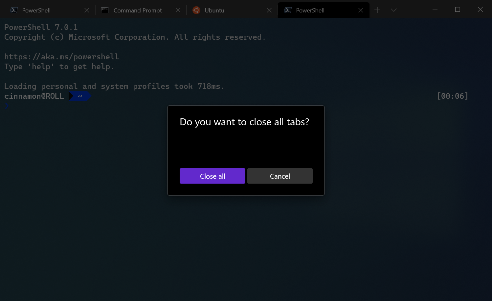
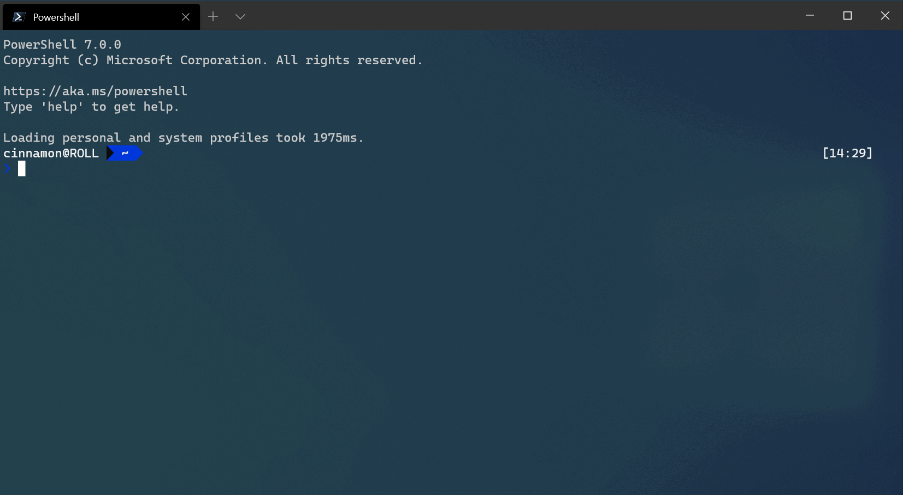

# Global settings in the Windows Terminal

The properties listed below affect the entire window, regardless of the profile settings.

## Default profile

Sets the default profile which opens by typing `ctrl+shift+t` or by clicking the '+' icon.

**Property name:** `defaultProfile`

**Necessity:** Required

**Accepts:** GUID as a string

**Default value:** PowerShell's GUID

 

___

## Dark/Light theme

:::row:::
:::column span="":::
Sets the theme of the application. `"system"` will use the theme Windows is set to.

**Property name:** `requestedTheme`

**Necessity:** Required

**Accepts:** `"system"`, `"dark"`, `"light"`

**Default value:** `"system"`

:::column-end:::
:::column span="":::

_Configuration: [Powerline in PowerShell](./custom-terminal-gallery/powerline-in-powershell.md)_

:::column-end:::
:::row-end:::

 

___

## Tab settings

### Always show tabs

:::row:::
:::column span="":::
When set to `true`, tabs are always displayed. When set to `false` and `showTabsInTitlebar` is set to `false`, tabs only appear after more than one tab exists by typing `ctrl+shift+t`.

**Property name:** `alwaysShowTabs`

**Necessity:** Required

**Accepts:** `true`, `false`

**Default value:** `true`

:::column-end:::
:::column span="":::

:::column-end:::
:::row-end:::

### Tab width mode

:::row:::
:::column span="":::
Sets the width of the tabs. `"equal"` makes each tab the same width. `"titleLength"` sizes each tab to the length of its title.

**Property name:** `tabWidthMode`

**Necessity:** Optional

**Accepts:** `"equal"`, `"titleLength"`

**Default value:** `"equal"`

:::column-end:::
:::column span="":::

:::column-end:::
:::row-end:::

### Hide close all tabs popup

:::row:::
:::column span="":::
When set to `true`, closing a window with multiple tabs open _will_ require confirmation. When set to `false`, closing a window with multiple tabs open _will not_ require confirmation.

**Property name:** `confirmCloseAllTabs`

**Necessity:** Optional

**Accepts:** `true`, `false`

**Default value:** `true`

:::column-end:::
:::column span="":::

:::column-end:::
:::row-end:::

 

___

## Launch settings

### Launch maximized

Defines whether the Terminal will launch as maximized or not.

**Property name:** `launchMode`

**Necessity:** Optional

**Accepts:** `"default"`, `"maximized"`

**Default value:** `"default"`

### Launch position

The position of the top left corner of the window upon first load. On a system with multiple displays, these coordinates are relative to the top left of the primary display. If `launchMode` is set to `"maximized"`, the window will be maximized on the monitor specified by those coordinates.

**Property name:** `initialPosition`

**Necessity:** Optional

**Accepts:** Coordinates as a string

**Default value:** `","`

### Columns on first launch

The number of columns displayed in the window upon first load.

**Property name:** `initialCols`

**Necessity:** Required

**Accepts:** Integer

**Default value:** `120`

### Rows on first launch

The number of rows displayed in the window upon first load.

**Property name:** `initialRows`

**Necessity:** Required

**Accepts:** Integer

**Default value:** `30`

 

___

## Title bar settings

### Show/Hide the title bar

:::row:::
:::column span="":::
When set to `true`, the tabs are moved into the title bar and the title bar disappears. When set to `false`, the title bar sits above the tabs.

**Property name:** `showTabsInTitlebar`

**Necessity:** Optional

**Accepts:** `true`, `false`

**Default value:** `true`

:::column-end:::
:::column span="":::

:::column-end:::
:::row-end:::

### Set the text in the title bar

When set to `true`, the title bar displays the title of the selected tab. When set to `false`, title bar displays "Windows Terminal".

**Property name:** `showTerminalTitleInTitlebar`

**Necessity:** Required

**Accepts:** `true`, `false`

**Default value:** `true`

 

___

## Selection settings

### Copy after selection is made

When set to `true`, a selection is immediately copied to your clipboard upon creation. When set to `false`, the selection persists and awaits further action.

**Property name:** `copyOnSelect`

**Necessity:** Optional

**Accepts:** `true`, `false`

**Default value:** `false`

### Word delimiters

Determines the word delimiters used in a double click selection.

**Property name:** `wordDelimiters`

**Necessity:** Optional

**Accepts:** Characters as a string

**Default value:** <code>&nbsp;&#x2f;&#x5c;&#x28;&#x29;&#x22;&#x27;&#x2d;&#x3a;&#x2c;&#x2e;&#x3b;&#x3c;&#x3e;&#x7e;&#x21;&#x40;&#x23;&#x24;&#x25;&#x5e;&#x26;&#x2a;&#x7c;&#x2b;&#x3d;&#x5b;&#x5d;&#x7b;&#x7d;&#x7e;&#x3f;│</code> _(`│` is `U+2502 BOX DRAWINGS LIGHT VERTICAL`)_

 

___

## Scroll speed

The number of rows to scroll at a time with the mouse wheel. This will override the system setting if the value is not zero or `"system"`.

**Property name:** `rowsToScroll`

**Necessity:** Optional

**Accepts:** Integer

**Default value:** `"system"`

 

___

## Window resize behavior

When set to `true`, the window will snap to the nearest character boundary on resize. When `false`, the window will resize "smoothly".

**Property name:** `snapToGridOnResize`

**Necessity:** Optional

**Accepts:** `true`, `false`

**Default value:** `true`
