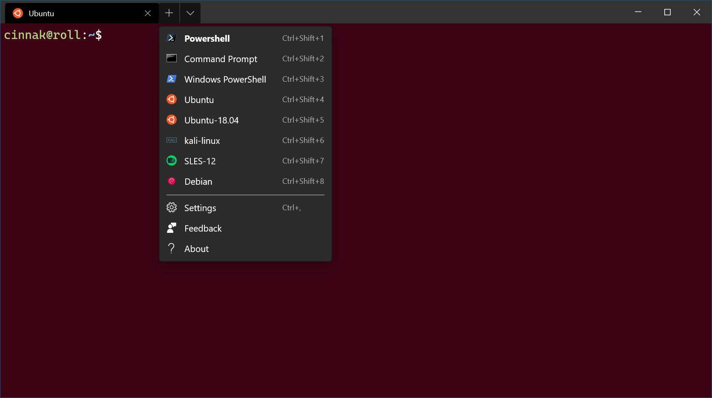
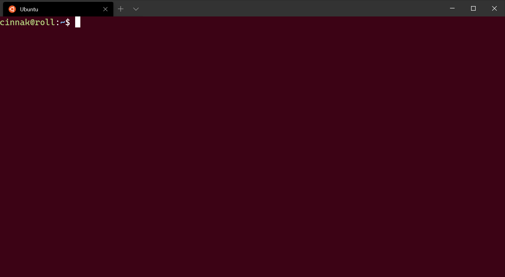
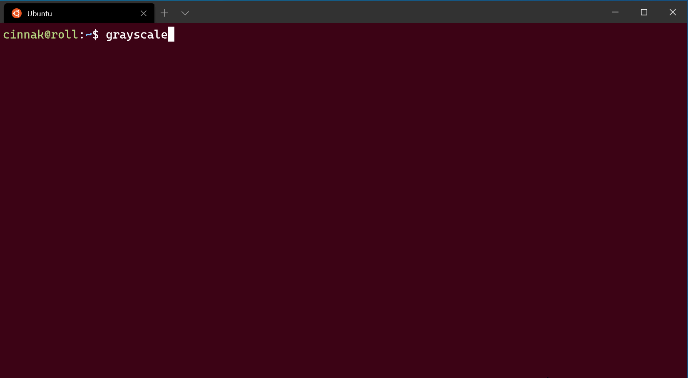
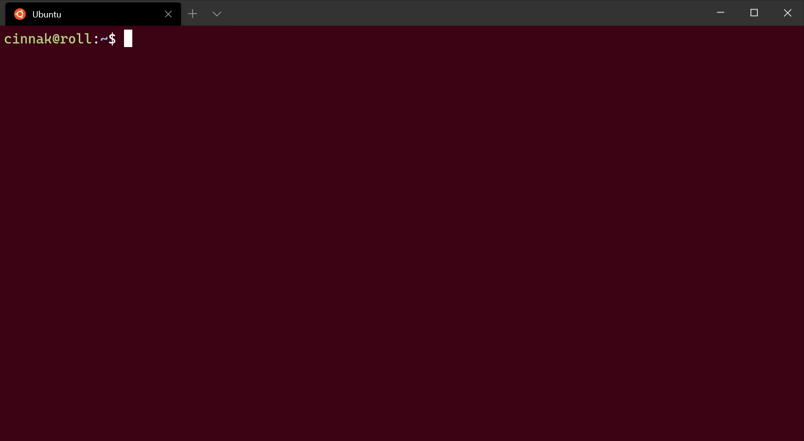
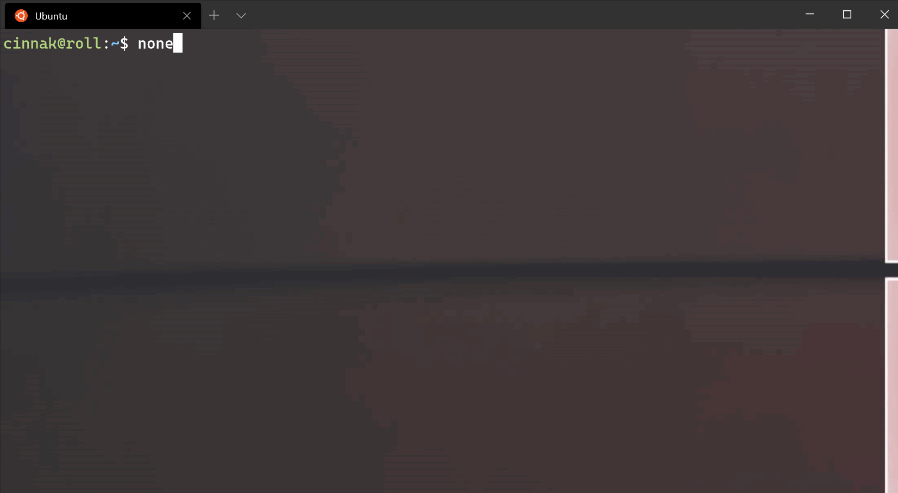
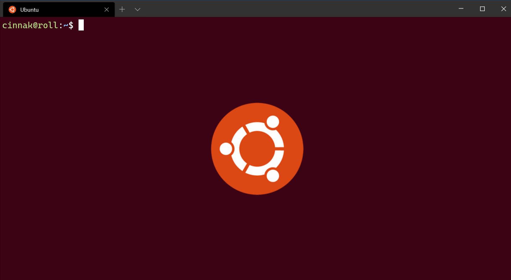
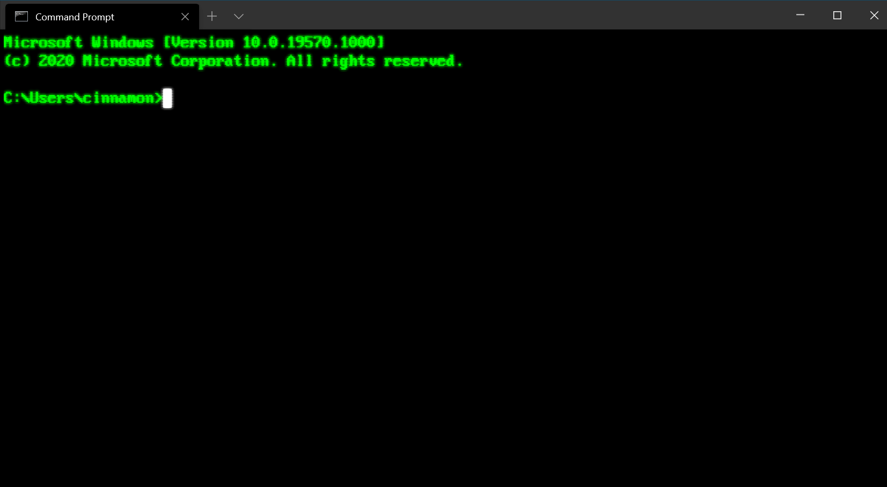

# Profile settings in Windows Terminal

The settings listed below are specific to each unique profile. If you'd like a setting to apply to all of your profiles, you can add it to the `defaults` section above the list of profiles in your settings.json file.

```json
"defaults":
{
    // SETTINGS TO APPLY TO ALL PROFILES
},
"list":
[
    // PROFILE OBJECTS
]
```

## Unique identifier

Profiles can use a GUID as a unique identifier. To make a profile your default profile, it needs a GUID for the `defaultProfile` global setting.

**Property name:** `guid`

**Necessity:** Required

**Accepts:** GUID as a string in registry format: `"{00000000-0000-0000-0000-000000000000}"`

<br />

___

## Executable settings

### Command line

This is the executable used in the profile.

**Property name:** `commandline`

**Necessity:** Optional

**Accepts:** Executable file name as a string

**Default value:** `"cmd.exe"`

### Source

This stores the name of the profile generator that originated the profile. _There are no discoverable values for this field._ For additional information on dynamic profiles, visit the [Dynamic profiles page](./../dynamic-profiles.md).

**Property name:** `source`

**Necessity:** Optional

**Accepts:** String

### Starting directory

This is the directory the shell starts in when it is loaded.

**Property name:** `startingDirectory`

**Necessity:** Optional

**Accepts:** Folder location as a string

**Default value:** `"%USERPROFILE%"`

<br />

> [!NOTE]
> When setting the starting directory that your installed WSL distributions open to, you should use this format: "startingDirectory": "\\\\wsl$\\<distro name>\\home\\<username>", replacing with the name of your distribution. For example, "startingDirectory": "\\\\wsl$\\Ubuntu-20.04\\home\\user1".

> [!NOTE]
> Omitting the startingDirectory value in a profile results in...
> ..if you run Windows Terminal from the Start menu: C:\windows\system32
> ..if you run wt.exe from the Start menu: C:\windows\system32
> ..if you run wt.exe from Win+R: %USERPROFILE%
> ..if you run wt.exe from the explorer address bar: whatever folder you were looking at.
___

## Dropdown settings


_Configuration: [Raspberry Ubuntu](./../custom-terminal-gallery/raspberry-ubuntu.md)_

### Name

This is the name of the profile that will be displayed in the dropdown menu. This value is also used as the "title" to pass to the shell on startup. Some shells (like `bash`) may choose to ignore this initial value, while others (`Command Prompt`, `PowerShell`) may use this value over the lifetime of the application. This "title" behavior can be overridden by using `tabTitle`.

**Property name:** `name`

**Necessity:** Required

**Accepts:** String

### Icon

This sets the icon that displays within the tab and the dropdown menu.

**Property name:** `icon`

**Necessity:** Optional

**Accepts:** File location as a string

### Hide a profile from the dropdown

If `hidden` is set to `true`, the profile will not appear in the list of profiles. This can be used to hide default profiles and dynamically generated profiles, while leaving them in your settings file. To learn more about dynamic profiles, visit the [Dynamic profiles page](./../dynamic-profiles.md).

**Property name:** `hidden`

**Necessity:** Optional

**Accepts:** `true`, `false`

**Default value:** `false`

<br />

___

## Tab title settings

### Custom tab title

If set, this will replace the `name` as the title to pass to the shell on startup. Some shells (like `bash`) may choose to ignore this initial value, while others (`Command Prompt`, `PowerShell`) may use this value over the lifetime of the application. If you'd like to learn how to have the shell set your title, visit the [tab title tutorial](./../tutorials/tab-title.md).

**Property name:** `tabTitle`

**Necessity:** Optional

**Accepts:** String

### Suppress title changes from the shell

When this is set to `true`, `tabTitle` overrides the default title of the tab and any title change messages from the application will be suppressed. If `tabTitle` isn't set, `name` will be used instead. When this is set to `false`, `tabTitle` behaves as normal.

**Property name:** `suppressApplicationTitle`

**Necessity:** Optional

**Accepts:** `true`, `false`

<br />

___

## Text settings

### Font face

This is the name of the font face used in the profile. The terminal will try to fallback to Consolas if this can't be found or is invalid. To learn about the other variants of the default font, Cascadia Mono, visit the [Cascadia Code page](./../cascadia-code.md).

**Property name:** `fontFace`

**Necessity:** Optional

**Accepts:** Font name as a string

**Default value:** `"Cascadia Mono"`

### Font size

This sets the profile's font size in points.

**Property name:** `fontSize`

**Necessity:** Optional

**Accepts:** Integer

**Default value:** `12`

### Font weight

This sets the weight (lightness or heaviness of the strokes) for the profile's font.

**Property name:** `fontWeight`

**Necessity:** Optional

**Accepts:** `"normal"`, `"thin"`, `"extra-light"`, `"light"`, `"semi-light"`, `"medium"`, `"semi-bold"`, `"bold"`, `"extra-bold"`, `"black"`, `"extra-black"`, or an integer corresponding to the numeric representation of the OpenType font weight

**Default value:** `"normal"`

### Padding

:::row:::
:::column span="":::
This sets the padding around the text within the window. This will accept three different formats: `"#"` and `#` set the same padding for all sides, `"#, #"` sets the same padding for left-right and top-bottom, and `"#, #, #, #"` sets the padding individually for left, top, right, and bottom.

**Property name:** `padding`

**Necessity:** Optional

**Accepts:** Values as a string in the following formats: `"#"`, `"#, #"`, `"#, #, #, #"` or value as an integer: `#`

**Default value:** `"8, 8, 8, 8"`

:::column-end:::
:::column span="":::


:::column-end:::
:::row-end:::

> [!IMPORTANT]
> `padding` as an integer is only available in [Windows Terminal Preview](https://aka.ms/terminal-preview/).

### Antialiasing text

This controls how text is antialiased in the renderer. Note that changing this setting will require starting a new terminal instance.



**Property name:** `antialiasingMode`

**Necessity:** Optional

**Accepts:** `"grayscale"`, `"cleartype"`, `"aliased"`

**Default value:** `"grayscale"`

<br />

___

## Cursor settings

### Cursor shape

This sets the cursor shape for the profile. The possible cursors are as follows: `"bar"` ( &#x2503; ), `"vintage"` ( &#x2583; ), `"underscore"` ( &#x2581; ), `"filledBox"` ( &#x2588; ), `"emptyBox"` ( &#x25AF; )

**Property name:** `cursorShape`

**Necessity:** Optional

**Accepts:** `"bar"`, `"vintage"`, `"underscore"`, `"filledBox"`, `"emptyBox"`

**Default value:** `"bar"`

### Cursor color

This sets the cursor color of the profile. This will override the `cursorColor` set in the color scheme if `colorScheme` is set.

**Property name:** `cursorColor`

**Necessity:** Optional

**Accepts:** Color as a string in hex format: `"#rgb"` or `"#rrggbb"`

### Cursor height

This sets the percentage height of the cursor starting from the bottom. This will only work when `cursorShape` is set to `"vintage"`.

**Property name:** `cursorHeight`

**Necessity:** Optional

**Accepts:** Integer from 25-100

<br />

___

## Keyboard settings

### AltGr aliasing

This allows you to control if Windows Terminal will treat <kbd>ctrl+alt</kbd> as an alias for <kbd>AltGr</kbd>.

**Property name:** `altGrAliasing`

**Necessity:** Optional

**Accepts:** `true`, `false`

**Default value:** `true`

<br />

___

## Color settings

### Color scheme

This is the name of the color scheme used in the profile. Color schemes are defined in the `schemes` object. More detailed information can be found on the [Color schemes page](./color-schemes.md).

**Property name:** `colorScheme`

**Necessity:** Optional

**Accepts:** Name of color scheme as a string

**Default value:** `"Campbell"`

### Tab color ([Preview](https://aka.ms/terminal-preview))

This sets the color of the profile's tab. Using the tab color picker will override this color.

**Property name:** `tabColor`

**Necessity:** Optional

**Accepts:** Color as a string in hex format: `"#rgb"` or `"#rrggbb"`

> [!IMPORTANT]
> This feature is only available in [Windows Terminal Preview](https://aka.ms/terminal-preview/).

### Foreground color

This changes the foreground color of the profile. This overrides `foreground` set in the color scheme if `colorScheme` is set.

**Property name:** `foreground`

**Necessity:** Optional

**Accepts:** Color as a string in hex format: `"#rgb"` or `"#rrggbb"`

### Background color

This changes the background color of the profile with this setting. This overrides `background` set in the color scheme if `colorScheme` is set.

**Property name:** `background`

**Necessity:** Optional

**Accepts:** Color as a string in hex format: `"#rgb"` or `"#rrggbb"`

### Selection background color

This sets the background color of a selection within the profile. This will override the `selectionBackground` set in the color scheme if `colorScheme` is set.

**Property name:** `selectionBackground`

**Necessity:** Optional

**Accepts:** Color as a string in hex format: `"#rgb"` or `"#rrggbb"`

<br />

___

## Acrylic settings

### Enable acrylic

:::row:::
:::column span="":::
When this is set to `true`, the window will have an acrylic background. When it's set to `false`, the window will have a plain, untextured background. The transparency only applies to focused windows due to OS limitations.

**Property name:** `useAcrylic`

**Necessity:** Optional

**Accepts:** `true`, `false`

**Default value:** `false`

:::column-end:::
:::column span="":::


:::column-end:::
:::row-end:::

### Acrylic opacity

:::row:::
:::column span="":::
When `useAcrylic` is set to `true`, this sets the transparency of the window for the profile. This accepts floating point values from 0-1.

**Property name:** `acrylicOpacity`

**Necessity:** Optional

**Accepts:** Number as a floating point value from 0-1

**Default value:** `0.5`

:::column-end:::
:::column span="":::


:::column-end:::
:::row-end:::

<br />

___

## Background image settings

### Setting the background image

This sets the file location of the image to draw over the window background. The background image can be a .jpg, .png, or .gif file.

**Property name:** `backgroundImage`

**Necessity:** Optional

**Accepts:** File location as a string

### Background image stretch mode

:::row:::
:::column span="":::
This sets how the background image is resized to fill the window.

**Property name:** `backgroundImageStretchMode`

**Necessity:** Optional

**Accepts:** `"none"`, `"fill"`, `"uniform"`, `"uniformToFill"`

**Default value:** `"uniformToFill"`

:::column-end:::
:::column span="":::

_[Background image source](https://wallpaperhub.app/wallpapers/6287)_

:::column-end:::
:::row-end:::

### Background image alignment

:::row:::
:::column span="":::
This sets how the background image aligns to the boundaries of the window.

**Property name:** `backgroundImageAlignment`

**Necessity:** Optional

**Accepts:** `"center"`, `"left"`, `"top"`, `"right"`, `"bottom"`, `"topLeft"`, `"topRight"`, `"bottomLeft"`, `"bottomRight"`

**Default value:** `"center"`

:::column-end:::
:::column span="":::

_[Background image source](https://design.ubuntu.com/brand/ubuntu-logo/)_

:::column-end:::
:::row-end:::

### Background image opacity

:::row:::
:::column span="":::
This sets the transparency of the background image.

:::column-end:::
:::row-end:::

**Property name:** `backgroundImageOpacity`

**Necessity:** Optional

**Accepts:** Number as a floating point value from 0-1

**Default value:** `1.0`

<br />

___

## Scroll settings

### Scrollbar visibility

This sets the visibility of the scrollbar.

**Property name:** `scrollbarState`

**Necessity:** Optional

**Accepts:** `"visible"`, `"hidden"`

### Scroll to input line when typing

When this is set to `true`, the window will scroll to the command input line when typing. When it's set to `false`, the window will not scroll when you start typing.

**Property name:** `snapOnInput`

**Necessity:** Optional

**Accepts:** `true`, `false`

**Default value:** `true`

### History size

This sets the number of lines above the ones displayed in the window you can scroll back to.

**Property name:** `historySize`

**Necessity:** Optional

**Accepts:** Integer

**Default value:** `9001`

<br />

___

## How the profile closes when exiting

This sets how the profile reacts to termination or failure to launch. `"graceful"` will close the profile when `exit` is typed or when the process exits normally. `"always"` will always close the profile and `"never"` will never close the profile. `true` and `false` are accepted as synonyms for `"graceful"` and `"never"`, respectively.

**Property name:** `closeOnExit`

**Necessity:** Optional

**Accepts:** `"graceful"`, `"always"`, `"never"`, `true`, `false`

**Default value:** `"graceful"`

<br />

___

## Retro terminal effects

:::row:::
:::column span="":::
When this is set to `true`, the terminal will emulate a classic CRT display with scan lines and blurry text edges. This is an experimental feature and its continued existence is not guaranteed.

**Property name:** `experimental.retroTerminalEffect`

**Necessity:** Optional

**Accepts:** `true`, `false`

**Default value:** `false`

:::column-end:::
:::column span="":::

_Configuration: [Retro Command Prompt](./../custom-terminal-gallery/retro-command-prompt.md)_

:::column-end:::
:::row-end:::
