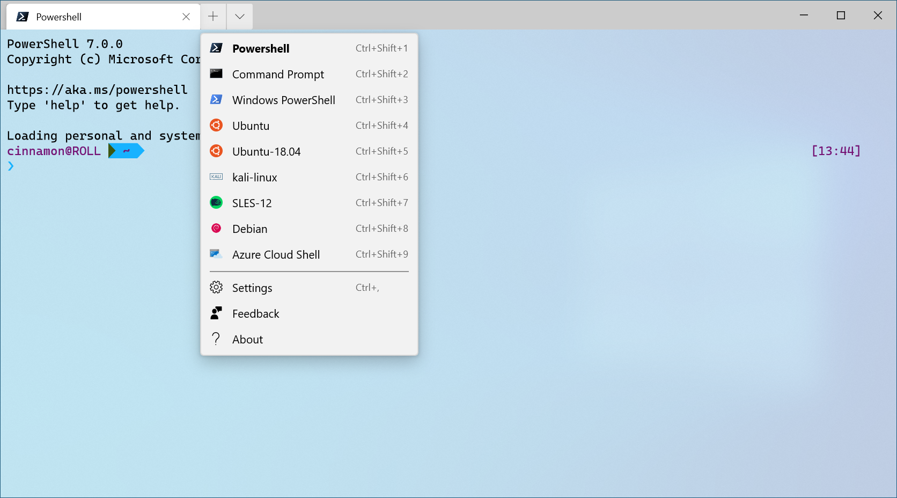

# Dynamic profiles in Windows Terminal

The Windows Terminal will automatically create Windows Subsystem for Linux (WSL) and PowerShell profiles for you if you have these shells installed on your machine. This makes it easier for you to have all of your shells included in the Terminal without having to locate their executable files. These profiles are generated with the `source` property, which tells the Terminal where to locate the proper executable.

Upon installation of the Terminal, it will set Powershell as your default profile. To learn how to change your default profile, visit the [global settings page](./customize-settings/global-settings.md).


_Configuration: [Light Theme](./custom-terminal-gallery/light-theme.md)_

## What if I install a new shell after installing the Terminal?

The Terminal will create a new profile for the newly installed shell, regardless if it was installed before or after your Terminal installation.

## How do I hide a profile?

If you'd like to hide a profile from your Terminal dropdown, you can add the `hidden` property to your profile in your settings file and set it to `true`.

```json
"hidden": true
```

If you delete a dynamically-created profile from your settings file, the Terminal will automatically regenerate the profile and replace it in the JSON.
