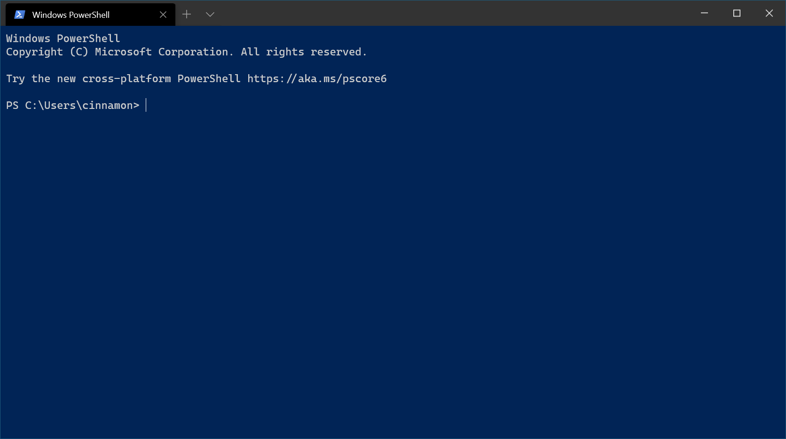

# Install and set up Windows Terminal

## Installation

You can install the Windows Terminal from the [Microsoft Store](https://aka.ms/terminal).

If you don't have access to the Microsoft Store, the builds are published on the [GitHub releases page](https://github.com/microsoft/terminal/releases). If you install from GitHub, the Terminal will not automatically update with new versions.

## First run

After installation, when you open the Terminal, it will start with PowerShell as the default profile in the open tab.

## Open a new tab

You can open a new tab of the default profile by pressing `ctrl+shift+t` or by selecting the + (plus) button. To open a different profile, select the ˅ (arrow) next to the + button to open the dropdown menu. From there, you can select which profile to open.

## Configuration

To customize the settings of your Windows Terminal, select **Settings** in the dropdown menu. This will open the `settings.json` file in your default text editor. (The default text editor is defined in your [Windows settings](ms-settings:defaultapps).)

## Troubleshooting

If you encounter any difficulties using the Windows Terminal, reference the [Troubleshooting page](./troubleshooting.md). If you find any bugs or have a feature request, you can select the feedback link in the **About** menu of the terminal to go to the [GitHub page](https://github.com/microsoft/terminal) where you can file a new issue.
