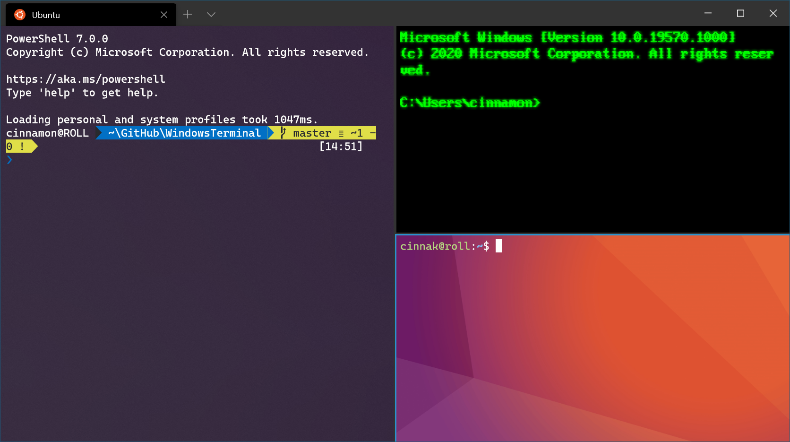

# What is Windows Terminal?

The Windows Terminal is a new, modern, fast, efficient, powerful, and productive terminal application for users of command line tools and shells like Command Prompt, PowerShell, and Windows Subsystem for Linux (WSL). Its main features include multiple tabs, panes, Unicode and UTF-8 character support, a GPU accelerated text rendering engine, and custom schemes and configurations.

> [!NOTE]
> [What's the difference between a console, a terminal, and a shell?](https://www.hanselman.com/blog/WhatsTheDifferenceBetweenAConsoleATerminalAndAShell.aspx) Read Scott Hanselman's explanation.

## Multiple profiles supporting a variety of command line applications

Any application that has a command line interface can be run inside the Windows Terminal. This includes everything from PowerShell and Command Prompt to Azure Cloud Shell and any WSL distribution such as Ubuntu or Oh-My-Zsh.

## Customized schemes and configurations

You can configure your Windows Terminal to have a variety of color schemes and settings. To learn how to make your own color scheme, visit the [Color schemes page](./customize-settings/color-schemes.md). You can also find custom Terminal configurations in the [Custom terminal gallery](./custom-terminal-gallery/powerline-in-powershell.md).

## Custom key bindings

There are a variety of custom key combinations you can use in the Windows Terminal to have it feel more natural to you. You can learn about customizing your key bindings on the [Key bindings page](./customize-settings/key-bindings.md).

## Unicode and UTF-8 character support

The Windows Terminal can display Unicode and UTF-8 characters such as emoji and characters from a variety of languages.

## GPU accelerated text rendering

The Windows Terminal uses the GPU to render its text, thus providing improved performance over the default Windows command line experience.

## Background image support

You can have background images and gifs inside your Windows Terminal window. Information on how to add background images to your profile can be found on the [Profile settings page](./customize-settings/profile-settings.md#background-image-settings).

## Command line arguments

You can set the Windows Terminal to launch in a specific configuration using command line arguments. Learn how to set up command line arguments on the [Command line arguments page](./command-line-arguments.md).
