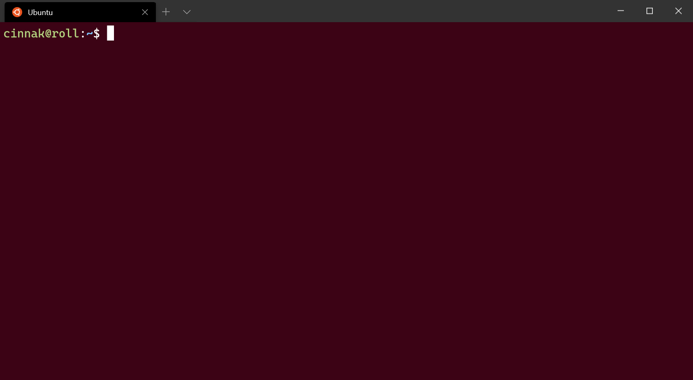
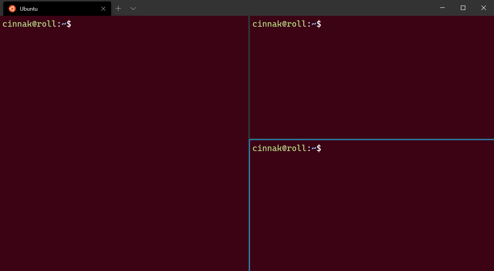
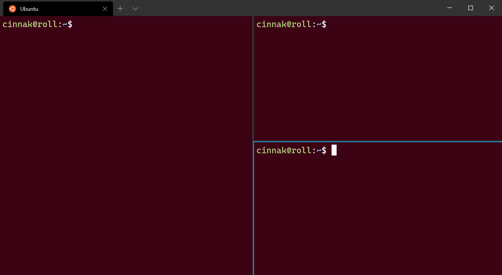
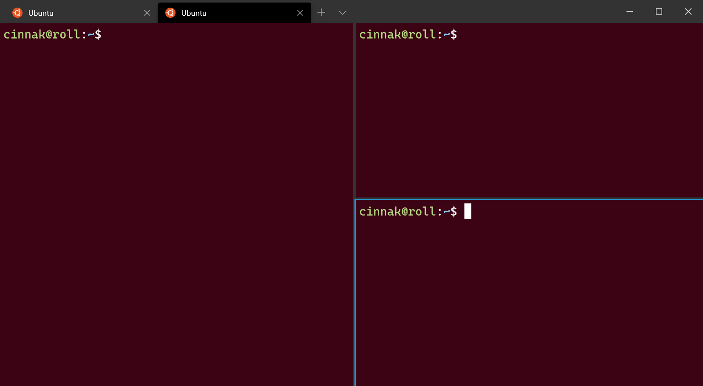
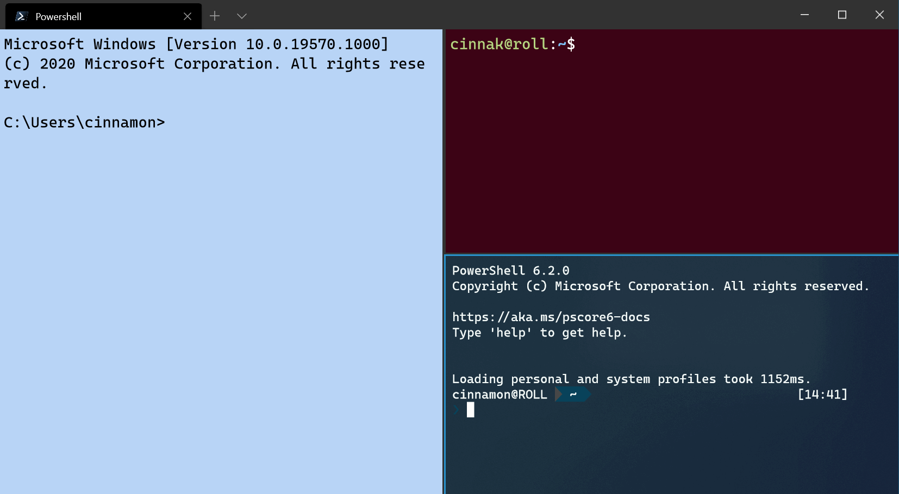

# Panes in Windows Terminal

Panes give you the ability to run multiple command line applications next to each other within the same tab. This minimizes the need to switch between tabs and lets you see multiple prompts at once.

## Creating a new pane

You can either create a new vertical or horizontal pane in the Terminal. Splitting vertically will open a new pane to the right of the focused pane and splitting horizontally will open a new pane below the focused pane. To create a new vertical pane of your default profile, you can type `Alt+Shift+Plus`. For a horizontal pane of your default profile, you can type `Alt+Shift+-`.


_Configuration: [Raspberry Ubuntu](./custom-terminal-gallery/raspberry-ubuntu.md)_

If you'd like to change these key bindings, you can create new ones using the `splitPane` action and `vertical` or `horizontal` values for the `split` property in your profiles.json file. If you just want a pane with the maximum amount of surface area, you can set `split` to `auto`. To learn how key bindings work, visit the [key bindings page](./customize-settings/key-bindings.md).

```json
{ "command": { "action": "splitPane", "split": "vertical"}, "keys": "alt+shift+plus" },
{ "command": { "action": "splitPane", "split": "horizontal"}, "keys": "alt+shift+-" },
{ "command": { "action": "splitPane", "split": "auto"}, "keys": "alt+shift+|" }
```

## Switching between panes

The Terminal allows you to navigate between panes by using the keyboard. If you hold the `Alt` key, you can use your arrow keys to move your focus between panes. You can identify which pane is in focus by the accent color border surrounding it.



You can customize this by adding key bindings for the `moveFocus` command and setting the `direction` to either `down`, `left`, `right` or `up`.

```json
{ "command": { "action": "moveFocus", "direction": "down" }, "keys": "alt+down" },
{ "command": { "action": "moveFocus", "direction": "left" }, "keys": "alt+left" },
{ "command": { "action": "moveFocus", "direction": "right" }, "keys": "alt+right" },
{ "command": { "action": "moveFocus", "direction": "up" }, "keys": "alt+up" }
```

## Resizing a pane

You can adjust the size of your panes by holding `Alt+Shift` and using your arrow keys to resize the focused pane.



To customize this key binding, you can add new ones using the `resizePane` action and setting the `direction` to either `down`, `left`, `right`, or `up`.

```json
{ "command": { "action": "resizePane", "direction": "down" }, "keys": "alt+shift+down" },
{ "command": { "action": "resizePane", "direction": "left" }, "keys": "alt+shift+left" },
{ "command": { "action": "resizePane", "direction": "right" }, "keys": "alt+shift+right" },
{ "command": { "action": "resizePane", "direction": "up" }, "keys": "alt+shift+up" }
```

## Closing a pane

You can close the focused pane by typing `Ctrl+Shift+W`. If you only have one pane, `Ctrl+Shift+W` will close the tab.



You can change what keys close the pane by adding a key binding that uses the `closePane` command.

```json
{ "command": "closePane", "keys": "ctrl+shift+w" }
```

## Customizing panes using key bindings

You can customize the what opens inside a new pane depending on your custom key bindings.

### Duplicating a pane

The Terminal allows you to duplicate the focused pane's profile into another pane.



This can be done by adding the `splitMode` property with `duplicate` as the value to a `splitPane` key binding.

```json
{ "command": { "action": "splitPane", "split": "auto", "splitMode": "duplicate" }, "keys": "alt+shift+d" }
```

### New Terminal arguments

- new pane with specific profile, startingDirectory, etc.
