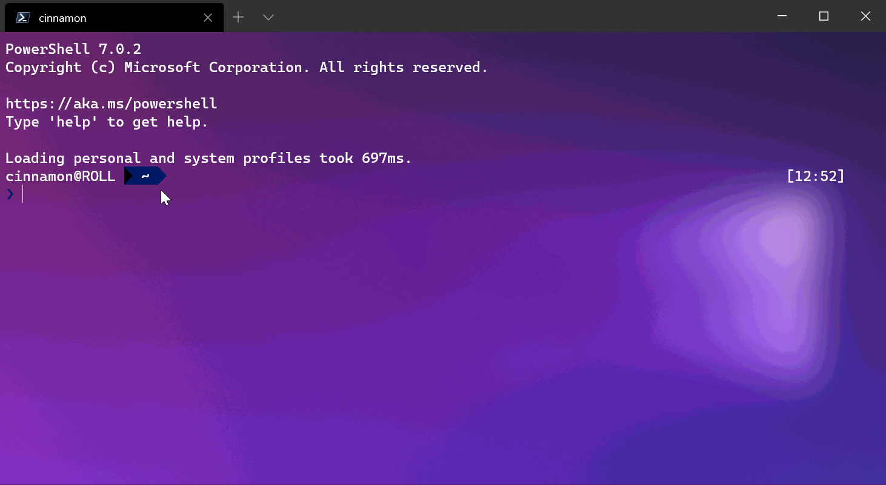
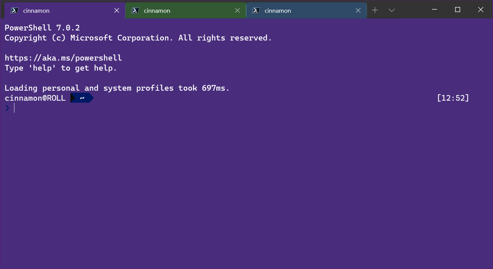

# Windows Terminal tips and tricks

## Rename a tab

You can right click on a tab and select Rename Tab to rename a tab for that terminal session. Clicking this option in the context menu will change your tab title into a text field, where you can then edit the title. If you'd like to set the tab title for that profile for every terminal instance, you can learn more in the [Tab title tutorial](./tutorials/tab-title.md).

## Color a tab

You can right click on a tab and select Color... to color the tab for that terminal session. You can select from a predefined list of colors or you can click Custom... to pick any color using the color picker or the RGB/HSV or hex fields.

> [!TIP]
> Use the hex field to set your tab to the same color as your background color for a seamless look.

## Zoom with the mouse

You can zoom the text window of Windows Terminal by holding <kbd>ctrl</kbd> and scrolling. The zoom will persist for that terminal session. If you want to change your font size, you can learn more about the font size feature on the [Profile settings page](./customize-settings/profile-settings#text-settings).

## Adjust background opacity with the mouse

You can adjust the opacity of the background by holding <kbd>ctrl+shift</kbd> and scrolling. The opacity will persist for that terminal session. If you want to change your acrylic opacity for a profile, you can learn more about acrylic background effects on the [Profile settings page](./customize-settings/profile-settings#acrylic-settings).
